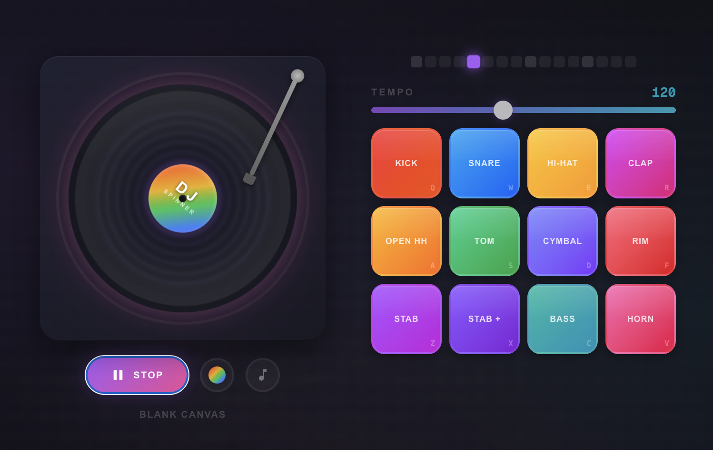

# DJ Spinner

An interactive cartoon turntable toy that brings the joy of DJing to your browser. Scratch the vinyl, smash the beat pads, drop some beats — no music degree required.

## What You Can Do

- 🎵 **Spin and scratch** virtual vinyl records with realistic turntable physics
- 🥁 **Play 15 sample pads** featuring drums, percussion, synths, bass, and horns
- 🎛️ **Control the tempo** with smooth BPM adjustment from 60–200
- 🎨 **Collect vinyl skins** — unlock 8 themed record designs
- 🎼 **Switch between genres** — from Lo-fi Hip Hop to Funk and House
- 🔄 **Record and layer loops** — flip the turntable to access the loop station, record pad hits into loops, and layer multiple patterns

## Quick Start

Click Play to start the beat, then:
- Drag the record to scratch
- Hit the drum pads (or use keyboard shortcuts)
- Adjust tempo with the slider
- Switch vinyls and tracks to explore different sounds
- **Click the LOOPS button on the turntable** to flip it over and access the loop station:
  - Hit REC to start recording pad hits into a loop
  - Record multiple layers and toggle them on/off
  - Use the Metronome track for freeform recording from scratch

**Try it now:** [dj.obscurebit.com](https://dj.obscurebit.com)

## For Developers

Technical details, setup instructions, and deployment info are available in **[DEVELOPMENT.md](DEVELOPMENT.md)**.
